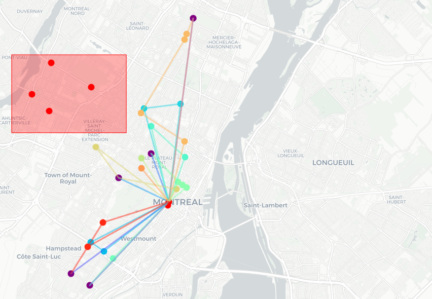

# Route Optimization - STM

This repository contains the code and data for the final project for MGSC 662 - Decision Analytics. The final project is a part of the course curriculum for the Master of Management in Analytics (MMA) program at the Desautels Faculty of Management, McGill University.

## Main Objective

The primary objective of this project is to develop an advanced optimization system focused on enhancing disaster response through intelligent route planning for bus-based evacuations in Montreal. In emergencies, traditional transit systems often become disrupted, emphasizing the need for efficient, adaptable evacuation operations. The project aims to utilize the city's existing transit infrastructure effectively while introducing flexible measures to ensure rapid and safe evacuation during times of crisis. An example solution can be seen below:

## Problem Description and Formulation

### Data Collection and Preparation

A comprehensive data collection pipeline forms the foundation of the Capacitated Vehicle Routing Problem (CVRP) model. The General Transit Feed Specification (GTFS) data from [Société de transport de Montréal](https://www.stm.info/en/about/developers) was used for detailed transit routes, schedules, and stop information. Additionally, road distances between all nodes were obtained via the [OSMnx](https://osmnx.readthedocs.io/en/stable/) package, providing information on the actual travel distances within the city's road network. The collected data was cleaned and preprocessed to ensure compatibility with the modeling environment and to establish a reliable baseline for the optimization process.

### Mathematical Formulation of the Capacitated Vehicle Routing Problem (CVRP)

The [CVRP model](https://developers.google.com/optimization/routing/cvrp) is formulated as a combinatorial optimization problem that seeks to identify the optimal set of routes for a fleet of buses tasked with evacuating residents to designated shelters. The model considers various parameters such as the set of all stops, disaster-stops, serviceable stops, distances between nodes, demand at each node, bus capacity, and the number of buses. The objective function minimizes the total distance traveled by all buses, subject to several constraints ensuring feasible routes and efficient evacuation operations.

### Split Delivery VRP

To address scenarios where the demand at a node exceeds the capacity of a single bus, the project introduces a series of algorithms to convert the CVRP into a Split Delivery VRP (SD-VRP). The idea is to split each node with demand exceeding bus capacity into multiple nodes with smaller demands. Different split methods, such as geometric split, capacity-based split, random split, and equal split, are explored and compared to balance the number of nodes and demand at each node.

### Report

For a detailed report of the project, please see [here](./deliverables/MGSC_662-Final_Project_Report-Group_3.pdf).

## How to run

We present 2 ways to reproduce the project and run the optimization model locally:

### Jupyter Notebook

1. Run the first cell to install all the necessary packages
2. Choose the bus routes to consider, the number of stops, the depot location, and the disaster area by changing these variables:
   - `routes`: list of bus routes to consider
   - `NUM_STOPS`: number of stops to consider
   - `depot`: depot location in `add_depot` (lat, lon)
   - `disaster_area`: disaster area in `add_disaster_area` (lat1, lon1, lat2, lon2)
3. Run all cells to load the necessary functions to run the optimization model (till "Run this model" section)
4. Choose the model parameters such as `NUM_BUSES`, `BUS_CAPACITY`, `DEMAND_LIMIT`, `DISTANCE_THRESHOLD` and solver parameters such as `TIME_LIMIT` and `MIPGap`
5. Run the specific type of model by choosing `split_type` among `geometric`, `capacity`, `random`, and `equal`
6. Call the `view_model` on the output of the above execution to see the model and the results

### Streamlit Application

1. Run `pip install -r requirements.txt` to install all the necessary packages
2. Run `streamlit run streamlit/app.py` to run the app
3. Add a depot location, wait for the distance matrix to be calculated, and then add a disaster area
4. Choose the model and solver parameters and run the model
